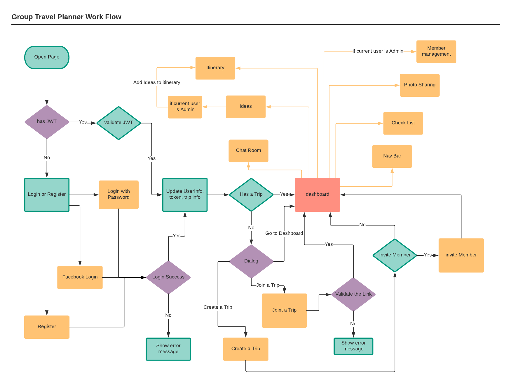
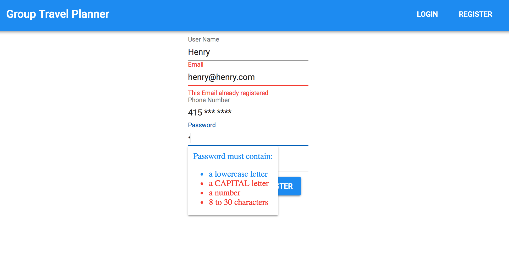
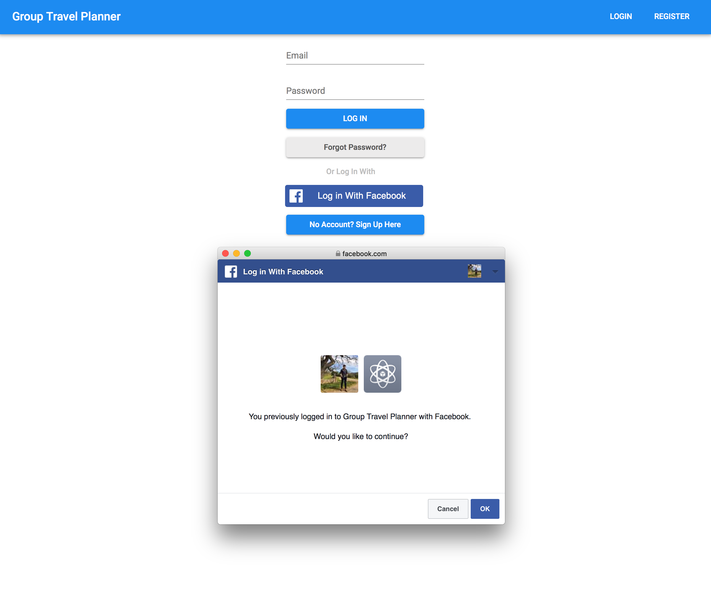
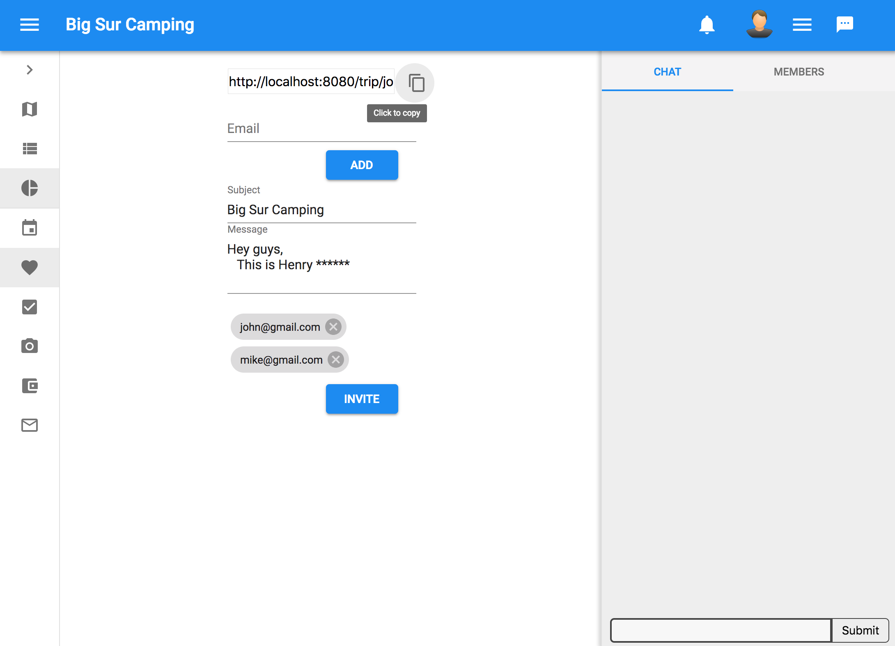
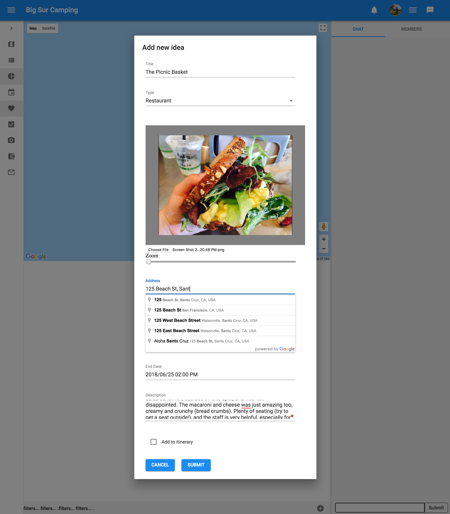
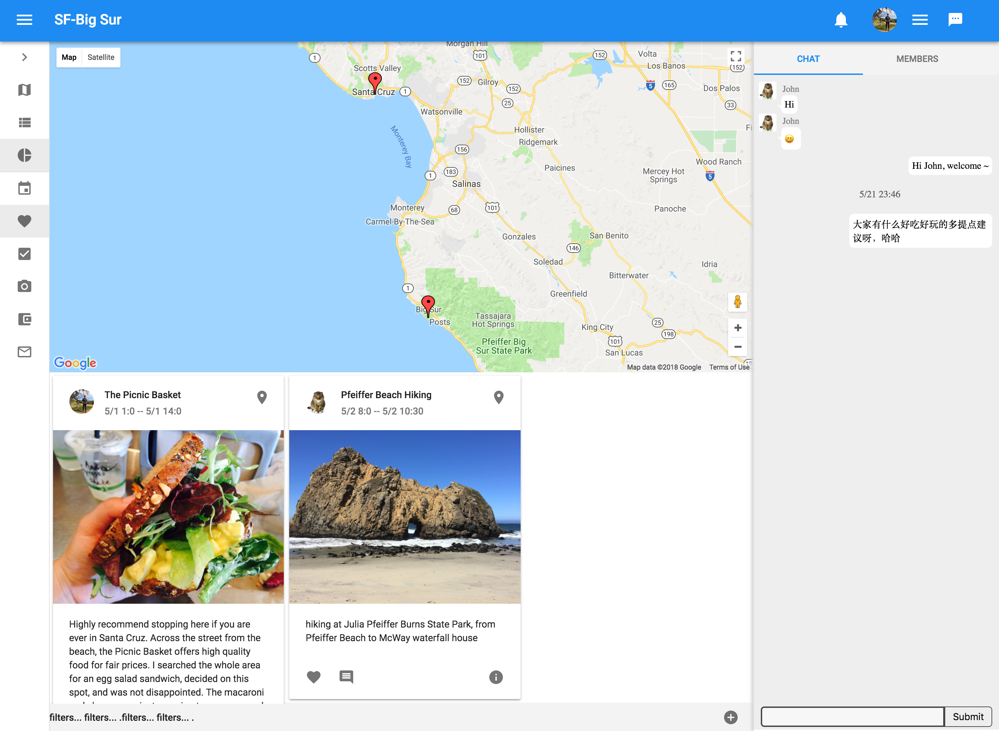
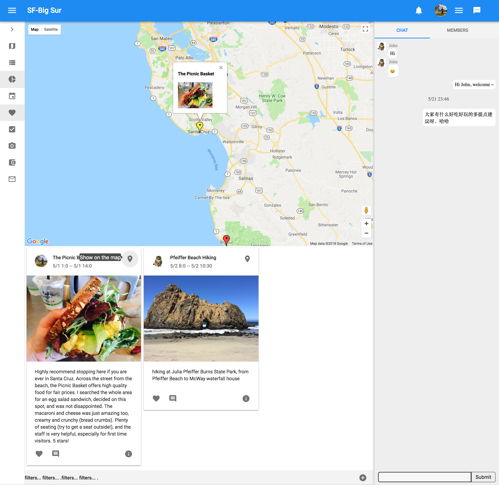
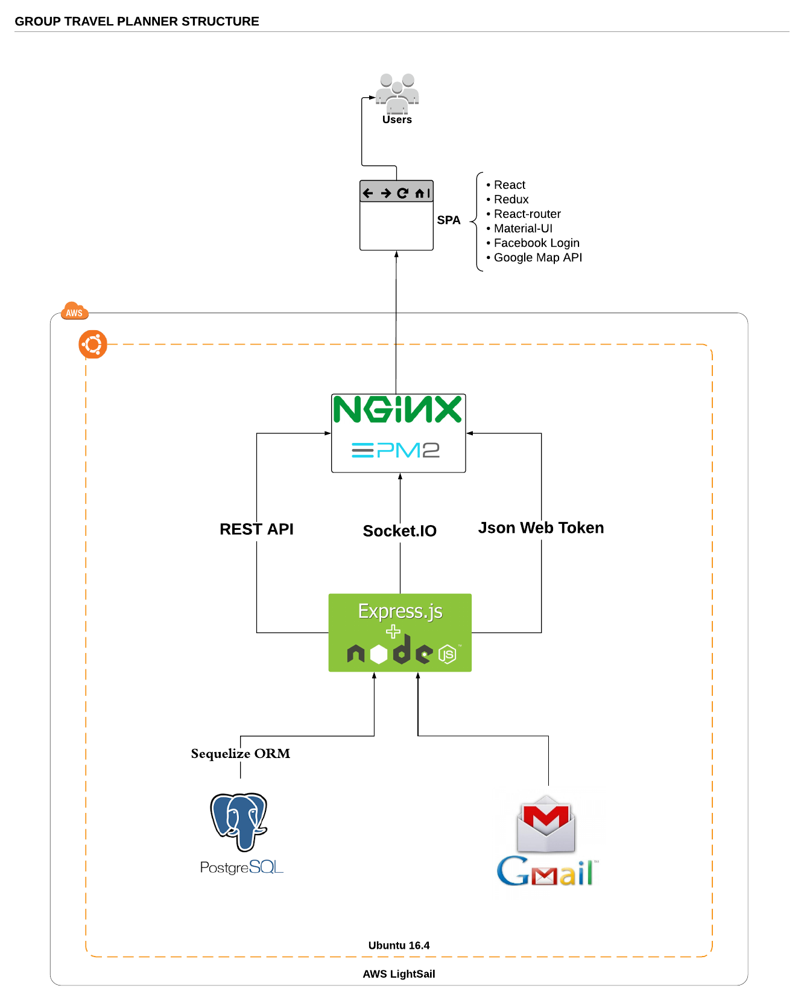

# Group Travel Planner Frontend
This repository contains frontend components for gtplanner.com, back end repository is [here](https://github.com/HenrySiau/group-travel-planner).
Group Travel Planner is a single page web application for sharing travel ideas and managing itinerary.
## Workflow

## User Registration
Register with email

FacebookLogin

## Invite members
Fill up this form and then back end will sent email with the invitation link, you can also copy the link and sent it with text message or from personal email.

## Ideas and Itinerary
create idea

## Views and Filters
you can close chat room and side tool bar, in the main section, you can choose show the map only, ideas only or split.

## Markers and Info Window

## Back end
